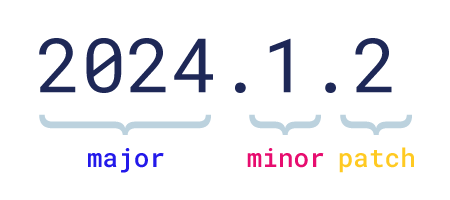

======================================
ScyllaDB Version Support 
======================================

Supported Versions
------------------------

.. datatemplate:json:: /_static/data/supported_versions.json
   :template: supported_versions.tmpl

Version Numbering
-------------------

ScyllaDB follows the MAJOR.MINOR.PATCH `semantic versioning <https://semver.org/>`_:

* ``MAJOR`` versions contain significant changes in the product and may
  introduce incompatible API changes.
* ``MINOR`` versions introduce new features and improvements in a backward-compatible manner.
* ``PATCH`` versions have backward-compatible bug fixes.

LTS vs. Feature Releases
----------------------------

Long-Term Support (LTS)

* Released approximately once a year.
* Two last LTS versions are supported.

Feature releases:

* 2-4 feature releases per year.

You can only use LTS releases (upgrading to the latest patch release for
the greatest stability) or follow the feature and LTS releases for the latest
feature set.

.. mermaid::

   flowchart LR

     %% Style definitions
     classDef feature fill:#c8dafc,stroke:#036,stroke-width:1px;
     classDef lts fill:#d5ebd6,stroke:#063,stroke-width:1px;

     %% LTS lane with background
     subgraph LTSLane["Long Term Support Lane"]
       style LTSLane fill:#f7f7d1,stroke:#aaa,stroke-width:1px
       direction LR
       LTS_2024_1["2024.1 LTS"]:::lts
       LTS_2024_1 --> LTS_2025_1["2025.1 LTS"]:::lts
       LTS_2025_1 --> LTS_2026_1["2026.1 LTS"]:::lts --> LTS_2027_1["2027.1 LTS"]:::lts
     end

     %% Feature lane with background
     subgraph FeatureLane["Feature Lane"]
       style FeatureLane fill:#fffad1,stroke:#aaa,stroke-width:1px
       direction LR
       F_2024_2["2024.2"]:::feature 
       F_2025_2["2025.2"]:::feature --> F_2025_3["2025.3"]:::feature --> F_2025_4["2025.4"]:::feature 
       F_2026_2["2026.2"]:::feature --> F_2026_3["2026.3"]:::feature --> F_2026_4["2026.4"]:::feature 
       F_2027_2["2027.2"]:::feature
     end

     %% Cross-lane arrows (solid and dashed)
     LTS_2024_1 --> F_2024_2
     F_2024_2 --> LTS_2025_1
     LTS_2025_1 --> F_2025_2
     F_2025_4 --> LTS_2026_1
     LTS_2026_1 --> F_2026_2
     F_2026_4 --> LTS_2027_1
     LTS_2027_1 --> F_2027_2

.. _version-support-policy:

Version Support Policy
-------------------------

* The last two LTS versions are supported.
* The last two *major.minor* versions (Feature or LTS release) are supported.

**Example**

* When 2024.2 (Feature) is released, the following are supported:

  * 2024.1 and 2023.1 (the last two LTS)
  * 2024.2 (Feature) and 2024.1 (LTS)

* When 2025.1 (LTS) is released, the following are supported:

  * 2025.1 and 2024.1 (the last two LTS)
  * 2024.2 (Feature)

* When 2025.2 (Feature) is released, the following are supported: 

  * 2025.1 and 2024.1 (the last two LTS)
  * 2025.2 (Feature)

Patch Versions
=================

All supported versions (major and minor, LTS and Feature) will get patch
releases when required.

We recommend upgrading to the latest patch version. You should especially
upgrade to the latest patch of your current version before upgrading to
a new major or minor version.

Upgrade Policy
----------------

To learn about the upgrade policy, see the `About Upgrade <https://docs.scylladb.com/manual/stable/upgrade/about-upgrade.html>`_
section in the ScyllaDB documentation.